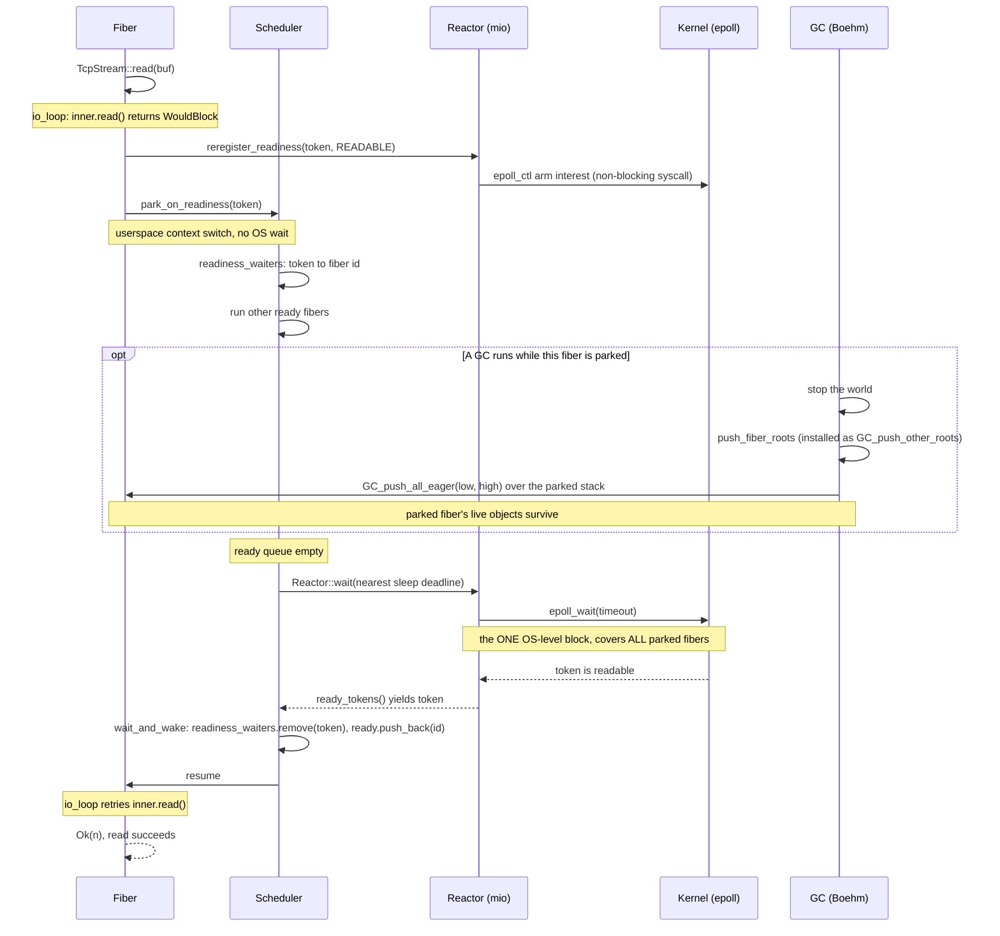

# Concurrency runtime: deferred socket I/O

How one non-blocking socket op suspends and resumes on the single-threaded fiber
scheduler. The runtime pieces live in `quilon-rt/src/`: the socket types in
`net.rs`, the scheduler + readiness plumbing in `scheduler.rs`, the `mio` poll
wrapper in `reactor.rs`, the fiber-stack GC integration in `gc.rs`, and the
blocking-call pool (for a call with no non-blocking form at all) in `blocking.rs`.

The trace below follows a single `TcpStream::read` that has to wait for data.

## Walkthrough

- **Parking is a userspace context switch.** When `inner.read`
  returns `WouldBlock`, `io_loop` arms read interest with `reregister_readiness`
  (a cheap, non-blocking `epoll_ctl`) and then calls `park_on_readiness`, which
  suspends the fiber back to the scheduler via a `corosensei` stack switch. The
  scheduler records `readiness_waiters[token] = fiber id` and keeps running other
  ready fibers. No thread blocks here.
- **The only OS-level block is one `epoll_wait`.** Once the ready queue drains,
  the scheduler calls `Reactor::wait` with the nearest sleep deadline as the
  timeout; that is the single `epoll_wait` that covers *every* parked fiber at
  once. Whichever fires first — a socket token becoming ready or the timer
  elapsing — returns it. `ready_tokens()` then hands each fired token to
  `wait_and_wake`, which maps it back through `readiness_waiters` to the exact
  fiber and requeues it; on resume the op retries.
- **Why fiber stacks are registered with the GC.** Boehm only scans the OS
  thread's stack, but a parked fiber's live roots sit on its own `corosensei`
  stack. Each fiber's stack range is registered (`gc::register`), so on a
  collection `push_fiber_roots` pushes every *parked* fiber's range with
  `GC_push_all_eager`, while the *running* fiber is covered by
  `GC_set_stackbottom` — so a collection triggered by another fiber's allocation
  keeps a socket-parked fiber's live objects.

## Blocking calls

Some calls have no non-blocking form at all — `getaddrinfo` (hostname resolution) is the one
this runtime makes — so they cannot park on reactor readiness the way a socket op does. `quilon-rt/src/blocking.rs`
runs such a call on a helper OS thread instead, through its one entry point,
`run_blocking(job)`: it queues `job` on the pool, parks the calling fiber on a fresh reactor
token, and returns once a worker has run it and woken the reactor through the same
`ReactorWaker` a resolver-style call already uses. `Err` only when the pool itself could not
start (thread creation refused) or `job` panicked — never for a value `job` computes, which
flows back as `Ok`.

The pool's sizing:

1. **Base size** is the process's CPU count — honouring cgroup quotas and CPU affinity, via
   `std::thread::available_parallelism` — with a minimum of 4.
2. **Lazy start:** the base threads start on the first blocking call; a program that never
   makes one starts none.
3. **Reuse:** base threads stay for the rest of the process, reused across calls.
4. **Growth and its ceiling:** under more concurrent calls than base threads, the pool grows
   by one overflow thread per call that finds every existing thread already busy, up to 16
   threads in total; a call beyond that waits in the queue.
5. **Shrink:** an overflow thread exits once it finds the job queue empty, so the pool settles
   back to its base once a burst of concurrent calls drains.

Neither the base nor the ceiling is configurable — no environment variable, no program-side
knob.
