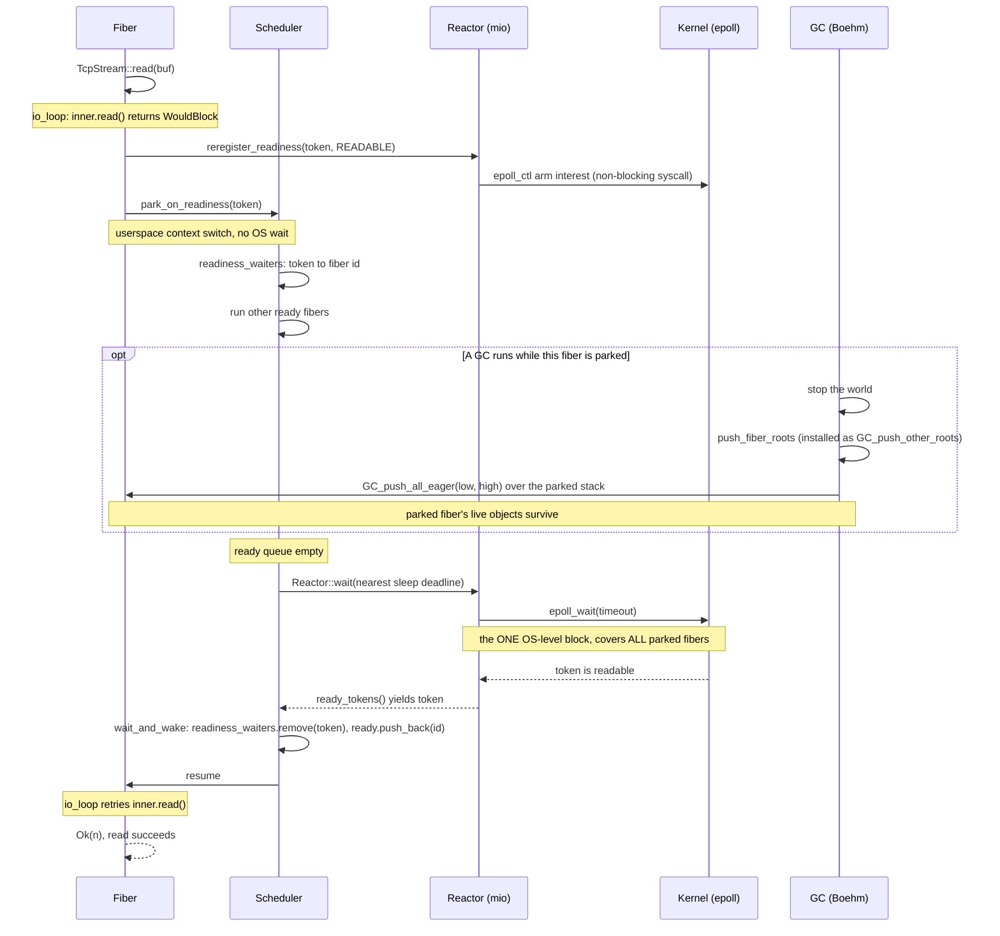

# Concurrency runtime: deferred socket I/O

How one non-blocking socket op suspends and resumes on the single-threaded fiber
scheduler. The runtime pieces live in `quilon-rt/src/`: the socket types in
`net.rs`, the scheduler + readiness plumbing in `scheduler.rs`, the `mio` poll
wrapper in `reactor.rs`, and the fiber-stack GC integration in `gc.rs`.

The trace below follows a single `TcpStream::read` that has to wait for data.

## Walkthrough

- **Parking is a userspace context switch.** When `inner.read`
  returns `WouldBlock`, `io_loop` arms read interest with `reregister_readiness`
  (a cheap, non-blocking `epoll_ctl`) and then calls `park_on_readiness`, which
  suspends the fiber back to the scheduler via a `corosensei` stack switch. The
  scheduler records `readiness_waiters[token] = fiber id` and keeps running other
  ready fibers. No thread blocks here.
- **The only OS-level block is one `epoll_wait`.** Once the ready queue drains,
  the scheduler calls `Reactor::wait` with the nearest sleep deadline as the
  timeout; that is the single `epoll_wait` that covers *every* parked fiber at
  once. Whichever fires first — a socket token becoming ready or the timer
  elapsing — returns it. `ready_tokens()` then hands each fired token to
  `wait_and_wake`, which maps it back through `readiness_waiters` to the exact
  fiber and requeues it; on resume the op simply retries.
- **Why fiber stacks are registered with the GC.** Boehm only scans the OS
  thread's stack, but a parked fiber's live roots sit on its own `corosensei`
  stack. Each fiber's stack range is registered (`gc::register`), so on a
  collection `push_fiber_roots` pushes every *parked* fiber's range with
  `GC_push_all_eager`, while the *running* fiber is covered by
  `GC_set_stackbottom` — so a collection triggered by another fiber's allocation
  keeps a socket-parked fiber's live objects.
