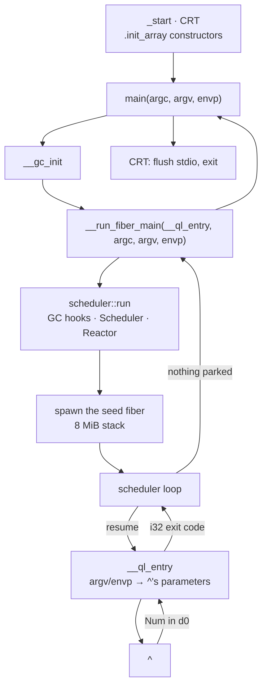

# ABI and calling convention

How a compiled Quilon program represents values, calls functions, and talks to the runtime
and the operating system.

**These choices are internal and may change in any release.** Every build is whole-program:
the compiler emits one object and links it against its own runtime, and every dependency on
these choices lives inside one build. This page describes the compiler's output for
understanding and debugging it.

## Three layers

| Layer | What it fixes | Set by |
|---|---|---|
| **OS ABI** | how a process starts, syscalls, `main`'s signature | the platform (Linux/macOS, x86-64/aarch64) |
| **C ABI** | which register holds argument 1, how a struct returns | the platform's C calling convention |
| **Quilon representations** | what a `Text` or a sum type looks like in memory | this compiler |

Quilon picks the third layer and adopts the first two unchanged.

## Calling convention

Quilon uses the platform's C calling convention. Codegen leaves every emitted function on
LLVM's default `ccc`.
A Quilon function is callable from C, and vice versa, with no shim.

`^ = () -> Num => 42`, built and disassembled on aarch64. Arguments first:

```
<main>:
   str  x30, [sp, #32]        save the return address before a call overwrites it
   bl   <__gc_init>           start the collector
   ldr  w1, [sp, #12]         argc  -> argument 2
   ldr  x2, [sp, #16]         argv  -> argument 3
   ldr  x3, [sp, #24]         envp  -> argument 4
   adrp x0, … / ldr x0, [x0]  the __ql_entry thunk -> argument 1, via the GOT
   bl   <__run_fiber_main>
   ret                        its result is already in w0
```

Then the return value, in the thunk `main` handed over:

```
<__ql_entry>:
   str    x30, [sp, #-16]!
   bl     <^>                 call the entry point
   fcvtzs w0, d0              its double result -> the integer exit code
   ldr    x30, [sp], #16
   ret
```

On aarch64 the convention is: integer and pointer arguments in `x0`–`x7` in order,
floating-point in `d0`–`d7`, integer results in `x0`/`w0`, floating-point results in `d0`, the
return address in `x30`, and `x19`–`x28` preserved across a call. x86-64 uses its own
registers under the same convention. Both are the platform's published C convention.

`^` returns a `Num`, so its value comes back in `d0`, and `fcvtzs` is where a `Num` becomes a
process exit code. The binary is position-independent, and the thunk's address is loaded
from the global offset table.

## Value representations

What each Quilon type is in memory. `ptr` is a pointer, `i64` a 64-bit integer.

| Type | Representation |
|---|---|
| `Num` | `double` (IEEE-754 binary64) |
| `Bool` | `i1` |
| `$` (Unit) | `i8`, always zero |
| `Text` | `{ ptr data, i64 byte_len }` — `data` points at a 16-byte header, then `byte_len` UTF-8 bytes (see [Text storage](#text-storage)) |
| array | `{ ptr data, i64 size }` at a function boundary; a pointer to that pair inside a body |
| map, set | one opaque pointer to a GC-allocated runtime structure |
| record | a struct of its field representations; a *named* record crosses a boundary by pointer |
| sum type | `{ i8 tag, …payload slots }` — one slot per payload position, sized to the widest variant |
| `Result` | `{ i8 tag, { ptr, i64 } }` — one canonical slot, whatever the payload |
| function value | `{ ptr fn, ptr env }` — the closure pair |

`Text` and arrays share a shape, and so do records and sums after lowering; the *declared*
Quilon type distinguishes them (see the type oracle in
[compiler architecture](architecture.md)).

## Text storage

Every `Text` allocation carries a write-once, 16-byte header immediately before its
bytes, and a trailing NUL byte after them. The value's `data` field points AT the header:

```
Text value: { data: ptr, byteLength: i64 }
data -> [ graphemeCount: i64 | flags: i64 | byteLength UTF-8 bytes | 0x00 ]
```

`flags`, one bit per fact free at creation:

| Bit | Name | Meaning |
|---|---|---|
| 0 | ASCII-aligned | every byte is ASCII, and lines up 1:1 with a grapheme (a `\r\n` pair keeps this off — it segments as one grapheme over two bytes) |
| 1 | Valid UTF-8 | the bytes are valid UTF-8 |
| 2 | Literal | the compiler's literal emitter produced this constant |
| 3 | No bidi controls | the bytes carry no Unicode bidirectional control character (the QN004 set) |

Bits 4-63 are reserved, always zero. The header is filled once, at creation, and stays
fixed for the value's whole life; a `Text` with a null `data` and `byteLength` `0` is the
empty text, with an all-true header (no content to contradict any bit) and no allocation
behind it. `length` reads the grapheme count directly, an O(1) read; `slice`/`at`/
`indexOf` read the ASCII-aligned bit and, when it is set, treat a byte offset as its own
grapheme index, skipping the Unicode segmentation walk a non-ASCII text still takes; a
decode (`` ` ``, `print`, every Text-method intrinsic) reads the valid-UTF-8 bit to skip
its own validation pass. The trailing NUL gives `--debug`'s `__render_c_string` thunk a
C string to hand a debugger with no copy — `data + 16` for a non-empty text, a static
empty C string otherwise.

### Under `--debug`

A `--debug` build describes `data` as a pointer to a named `TextStorage` composite
(`graphemeCount :: i64`, `flags :: i64`, `bytes :: [0 x i8]`), so a debugger's `p
*t.data` shows the count and flags alongside the content with no pretty-printer:

```
(lldb) p *t.data
(TextStorage) $0 = (graphemeCount = 5, flags = 14, bytes = "héllo")
```

## The runtime boundary

`libquilon_rt` is written in Rust and linked as a C library, under two rules:

- Every symbol generated code calls is `extern "C"` — the platform's C convention.
- Every type crossing the boundary is `#[repr(C)]`, so field offsets match what codegen emits.

A binary contains both: unmangled names such as `__run_fiber_main` at the boundary, and
mangled `_RNv…` names for the runtime's private Rust-to-Rust calls. Generated code reaches
the first kind; the boundary is the set of exported symbols.

## Start-up, end to end



The kernel jumps to `_start`. Everything from there to `^` is machinery: the C
runtime, the collector, and the scheduler that gives `^` a fiber to park on. The exit code
travels back up the same path — `^` returns a `Num` in `d0`, `__ql_entry` truncates it to
`i32`, and `main` hands that to the C runtime as the process status.

## The process contract

- The compiler generates `int main(int argc, char **argv, char **envp)` — the POSIX
  three-argument form — which initializes the collector, then runs `^`.
- `^` runs on the scheduler's seed fiber. `main` hands a `__ql_entry` thunk to
  `__run_fiber_main`, which runs it as that fiber, and any `@` primitive it reaches has a
  fiber to park on. See [the concurrency runtime](../concurrency/runtime.md).
- `^` is a real symbol named `^`. It appears that way in `nm` and `objdump` output.
- `^` takes one of three shapes: `()`, `(args :: []Text)`, or
  `(args :: []Text, env :: [|Text => Text|])`. See [entry point](../modules/entry-point.md).
- Its `Num` result is truncated to `i32` and becomes the exit status, which the kernel then
  masks to the low 8 bits: `^ => 300` exits with status 44.
- Falling off `main` returns to the C runtime, which flushes buffered output and runs
  destructors. Quilon does no teardown of its own.

## Inspecting a binary

```sh
quilon build examples/hello_world.qn -o hw

readelf -h hw                        # entry point (_start, not main) and PIE
objdump -d --disassemble=main hw     # the wrapper above
objdump -d --disassemble='^' hw      # your entry point
nm -C hw | grep -v _RNv              # the C-ABI surface
readelf -p .comment hw               # every compiler that touched the binary
```

`quilon compile prog.qn -o prog.ll` emits the LLVM IR for the same program. Builds use no
optimization, so IR and disassembly correspond closely — reading them side by side is the
quickest way to see how a Quilon construct lowers.
